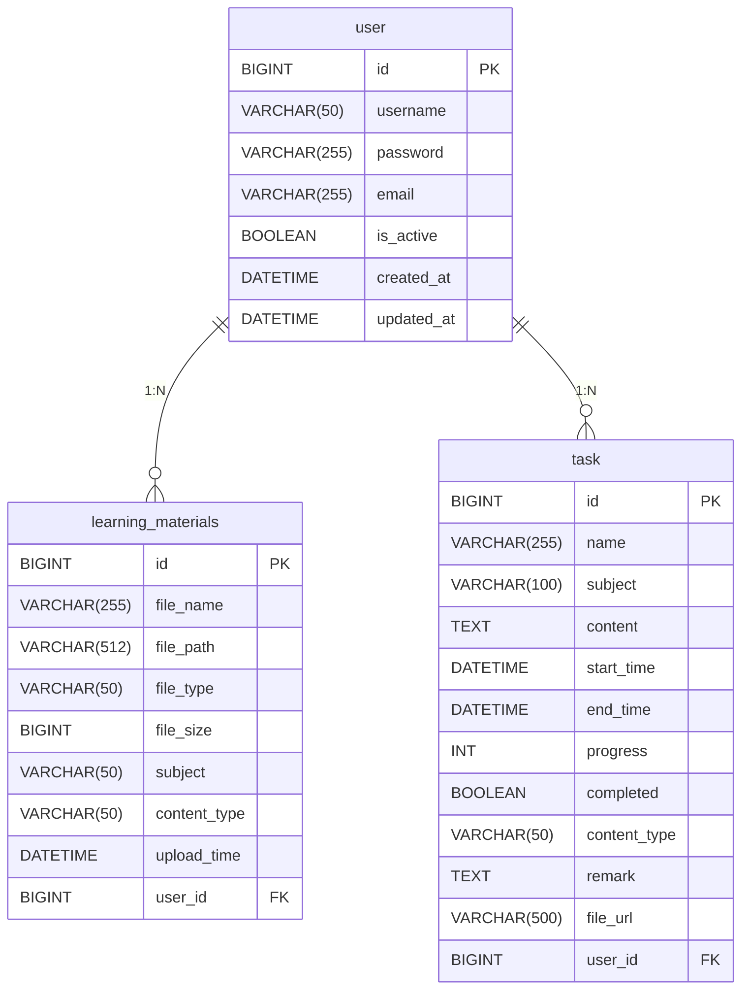

# 学习养成计划

## 项目背景

学习养成计划主要是针对学生考试任务的管理系统，通过可视化的图表展示数据，使用者能够有完成任务的成就感。

## 项目需求描述

学习养成计划用户可以添加学习任务，每个学习任务都有自己的主题、完成时间和优先级，根据设定的完成时间和优先级对用户进行不同频率的提醒，直到其完成该任务，任务可以设定提醒频率和时间期限，避免导致任务越堆积越多，除了用户自己可以设定任务以外，本软件后台也会针对不同科目来进行推送任务，软件还提供任务分析功能，针对用户每天的任务添加数和完成率进行统计，让使用者更好地知道自己的复习进度和完成率。

## 项目基础功能

1. 注册、登录功能；
2. 添加和管理学习任务；
3. 任务提醒功能；
4. 任务分析功能，有一些统计分析图表；
5. 5.学习进度跟踪以及内容记录；
6. 6.学习资料检索、收集以及整理；

## 项目拓展功能

1. 利用 AI 大模型生成任务完成情况报告；
2. 基于用户学习成果进行 AI 评估并能基于此提供改进建议；

## 数据库搭建

## 项目概述

本项目是一个基于Spring Boot + Vue.js的学习养成计划管理系统，使用MySQL作为主数据库，Redis作为缓存数据库。

## 数据库环境要求

- MySQL : 8.0+
- Redis : 6.0+
- 字符集 : UTF-8
- 时区 : Asia/Shanghai

## 数据库配置信息

根据项目配置文件，数据库连接信息如下：

```yaml
spring:
  datasource:
    url: jdbc:mysql://localhost:3306/learning_plan?useUnicode=true&characterEncoding=utf-8&serverTimezone=Asia/Shanghai
    username: root
    password: 使用自己数据库的密码
    driver-class-name: com.mysql.cj.jdbc.Driver
  redis:
    host: localhost
    port: 6379
    timeout: 2000ms
    database: 0
  jpa:
    hibernate:
      ddl-auto: update
    show-sql: true
    properties:
      hibernate:
        dialect: org.hibernate.dialect.MySQL8Dialect
        format_sql: true

mybatis-plus:
  mapper-locations: classpath:mapper/*.xml
  type-aliases-package: com.example.learning.learning_habit_plan_backend.entity
  configuration:
    map-underscore-to-camel-case: true
```

```markdown
# 学习养成计划项目数据库文档

## 1. 数据库概述
本数据库为学习养成计划项目的核心数据存储，包含用户信息、学习资料、任务管理等数据。采用MySQL 8.0+作为主数据库，Redis作为缓存数据库。

## 2. 数据库表结构

### 2.1 用户表 (user)

#### 建表SQL
```sql
CREATE TABLE user (
  id BIGINT PRIMARY KEY AUTO_INCREMENT,
  username VARCHAR(50) NOT NULL UNIQUE,
  password VARCHAR(255) NOT NULL,
  email VARCHAR(255) NOT NULL UNIQUE,
  is_active BOOLEAN DEFAULT TRUE,
  created_at DATETIME DEFAULT CURRENT_TIMESTAMP,
  updated_at DATETIME DEFAULT CURRENT_TIMESTAMP ON UPDATE CURRENT_TIMESTAMP
) ENGINE=InnoDB DEFAULT CHARSET=utf8mb4 COLLATE=utf8mb4_unicode_ci;
```

#### 字段说明
| 字段名     | 类型         | 约束                     | 默认值                     | 说明                |
|------------|--------------|--------------------------|----------------------------|---------------------|
| id         | BIGINT       | PRIMARY KEY, AUTO_INCREMENT | -                         | 用户唯一标识        |
| username   | VARCHAR(50)  | NOT NULL, UNIQUE         | -                         | 用户名(3-50字符)    |
| password   | VARCHAR(255) | NOT NULL                 | -                         | BCrypt加密后的密码  |
| email      | VARCHAR(255) | NOT NULL, UNIQUE         | -                         | 用户邮箱            |
| is_active  | BOOLEAN      | -                        | TRUE                      | 账户激活状态        |
| created_at | DATETIME     | -                        | CURRENT_TIMESTAMP          | 账户创建时间        |
| updated_at | DATETIME     | -                        | CURRENT_TIMESTAMP ON UPDATE | 最后更新时间        |

#### 索引设计
- 主键索引: `id`
- 唯一索引: `username`, `email`
- 普通索引: 建议在`created_at`上建立索引用于查询排序

### 2.2 学习资料表 (learning_materials)

#### 建表SQL
```sql
CREATE TABLE learning_materials (
  id BIGINT PRIMARY KEY AUTO_INCREMENT,
  file_name VARCHAR(255) NOT NULL,
  file_path VARCHAR(512) NOT NULL,
  file_type VARCHAR(50) NOT NULL,
  file_size BIGINT NOT NULL,
  subject VARCHAR(50) NOT NULL,
  content_type VARCHAR(50) NOT NULL,
  upload_time DATETIME DEFAULT CURRENT_TIMESTAMP,
  user_id BIGINT NOT NULL,
  FOREIGN KEY (user_id) REFERENCES user(id)
) ENGINE=InnoDB DEFAULT CHARSET=utf8mb4 COLLATE=utf8mb4_unicode_ci;
```

#### 字段说明
| 字段名       | 类型         | 约束        | 默认值            | 说明                  |
|--------------|--------------|-------------|-------------------|-----------------------|
| id           | BIGINT       | PRIMARY KEY | -                | 资料唯一标识          |
| file_name    | VARCHAR(255) | NOT NULL    | -                | 原始文件名            |
| file_path    | VARCHAR(512) | NOT NULL    | -                | 服务器存储路径        |
| file_type    | VARCHAR(50)  | NOT NULL    | -                | 文件MIME类型          |
| file_size    | BIGINT       | NOT NULL    | -                | 文件大小(字节)        |
| subject      | VARCHAR(50)  | NOT NULL    | -                | 学科分类              |
| content_type | VARCHAR(50)  | NOT NULL    | -                | 内容类型(笔记/教材等) |
| upload_time  | DATETIME     | -           | CURRENT_TIMESTAMP | 上传时间              |
| user_id      | BIGINT       | FOREIGN KEY | -                | 关联用户ID            |

#### 索引设计
```sql
CREATE INDEX idx_materials_user ON learning_materials(user_id);
CREATE INDEX idx_materials_subject ON learning_materials(subject);
CREATE INDEX idx_materials_type ON learning_materials(content_type);
```

### 2.3 任务表 (task)

#### 建表SQL
```sql
CREATE TABLE task (
  id BIGINT AUTO_INCREMENT PRIMARY KEY,
  name VARCHAR(255) NOT NULL,
  subject VARCHAR(100) NOT NULL,
  content TEXT,
  start_time DATETIME NOT NULL,
  end_time DATETIME NOT NULL,
  progress INT DEFAULT 0,
  completed BOOLEAN DEFAULT FALSE,
  content_type VARCHAR(50),
  remark TEXT,
  file_url VARCHAR(500),
  user_id BIGINT NOT NULL,
  FOREIGN KEY (user_id) REFERENCES user(id)
) ENGINE=InnoDB DEFAULT CHARSET=utf8mb4 COLLATE=utf8mb4_unicode_ci;
```

#### 字段说明
| 字段名       | 类型         | 约束        | 默认值   | 说明                  |
|--------------|--------------|-------------|----------|-----------------------|
| id           | BIGINT       | PRIMARY KEY | -        | 任务ID                |
| name         | VARCHAR(255) | NOT NULL    | -        | 任务名称              |
| subject      | VARCHAR(100) | NOT NULL    | -        | 学科分类              |
| content      | TEXT         | -           | NULL     | 任务详情              |
| start_time   | DATETIME     | NOT NULL    | -        | 开始时间              |
| end_time     | DATETIME     | NOT NULL    | -        | 截止时间              |
| progress     | INT          | -           | 0        | 完成进度(0-100)       |
| completed    | BOOLEAN      | -           | FALSE    | 是否完成              |
| content_type | VARCHAR(50)  | -           | NULL     | 任务类型              |
| remark       | TEXT         | -           | NULL     | 备注信息              |
| file_url     | VARCHAR(500) | -           | NULL     | 文件URL               |
| user_id      | BIGINT       | FOREIGN KEY | -        | 所属用户ID            |

#### 索引设计
```sql
CREATE INDEX idx_task_user ON task(user_id);
CREATE INDEX idx_task_subject ON task(subject);
CREATE INDEX idx_task_completed ON task(completed);
CREATE INDEX idx_task_time_range ON task(start_time, end_time);
```

## 3. 数据库关系图


## 4. Redis配置
- 端口: `6379`
- 数据库: `0`
- 用途: 会话缓存、频繁访问数据缓存

**启动命令:**
```bash
redis-server
```

**测试连接:**
```bash
redis-cli ping
```

## 5. 初始化验证SQL
```sql
-- 验证用户表
DESCRIBE user;
INSERT INTO user (username, password, email) 
VALUES ('testuser', '$2a$10$x...', 'test@example.com');
SELECT * FROM user WHERE username = 'testuser';

-- 验证学习资料表
DESCRIBE learning_materials;
INSERT INTO learning_materials (file_name, file_path, file_type, file_size, subject, content_type, user_id)
VALUES ('test.pdf', '/uploads/test.pdf', 'application/pdf', 1024, '数学', '教材', 1);
SELECT * FROM learning_materials WHERE user_id = 1;

-- 验证任务表
DESCRIBE task;
INSERT INTO task (name, subject, content, start_time, end_time, user_id)
VALUES ('数学作业', '数学', '完成第一章习题', '2023-01-01 09:00:00', '2023-01-07 23:59:59', 1);
SELECT * FROM task WHERE user_id = 1;
```

## 6. 最佳实践
1. **备份策略**:
    - 每日全量备份 + 二进制日志增量备份
    - 备份命令: `mysqldump -u root -p learning_db > backup.sql`

2. **性能优化**:
    - 定期执行 `ANALYZE TABLE` 更新统计信息
    - 监控慢查询日志: `SET GLOBAL slow_query_log = 'ON'`

3. **安全建议**:
    - 使用专用数据库用户，限制权限
    - 密码加密存储(项目已实现BCrypt加密)
    - 定期轮换数据库凭证

4. **扩展建议**:
    - 大文件考虑使用对象存储服务
    - 高并发场景可考虑读写分离

## 7. 注意事项
⚠️ **重要注意事项**:
1. 字符集统一使用 `utf8mb4`
2. 时区设置为 `Asia/Shanghai`
3. 生产环境必须修改默认凭证
4. 定期检查并优化索引

## 8. 版本历史
| 版本 | 日期       | 说明                  |
|------|------------|-----------------------|
| 1.0  | 2023-11-01 | 初始版本              |
| 1.1  | 2023-11-05 | 增加外键约束          |
| 1.2  | 2023-11-10 | 优化索引设计          |
| 1.3  | 2023-11-15 | 增加Mermaid关系图     |
```